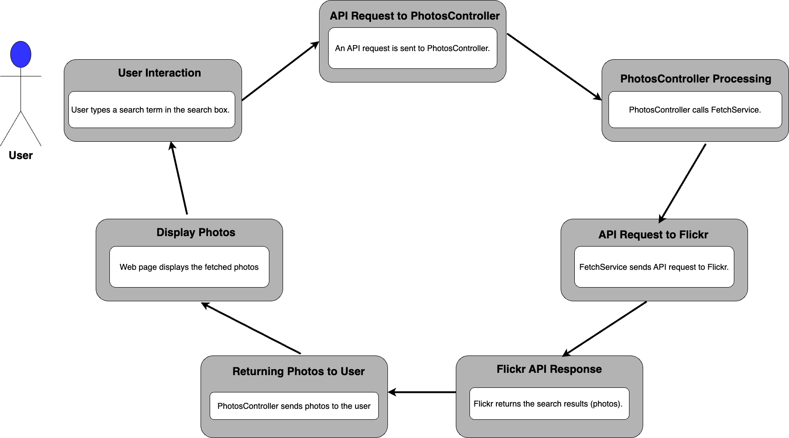

# Assignment Project

## Introduction
The Assignment project is a .Net 8 ASP.NET Core MVC web application developed. The backend part includes a REST API while the frontend is written in Javascript and CSS. The functional requirement for the application is as follows:

- The front end provides the users with a search functionality which in turn sends an API request to the backend REST API.  
- The REST API recieves the request and sends that further to Flickr public search API (flickr.photos.search)
- After fetching photos from Flickr, the backend sends a list of all photos back to the front end which in turn displays the photos to the user.

In other words, the application works as a proxy getting between users and Flickr service.

### Architectural Design (Conceptual)
An overview of the main components of the project and how they are related is described visually by the following architectural diagram.
The application is structured so that it separates concerns between user interactions (Controllers), data models (Models), business logic (Services), and views (Views). It also includes configuration files and resources (wwwroot) for front-end assets. 
Besides the main application, the solution contains two test projects for unit tesing and for integration testing. Besides, the application can be deployed to Container using Docker. 

![[Architecture Diagram]](Architecture.png)

### Project flow

A more detailed description of the flow of the main project (web application) is given below. 

## Getting Started

### Prerequisites
Ensure you have the following installed on your machine:

  - Visual Studio Code : https://code.visualstudio.com/download
  - C# for Visual Studio Code (latest version): https://marketplace.visualstudio.com/items?itemName=ms-dotnettools.csharp
  - .NET 8.0 SDK: https://dotnet.microsoft.com/en-us/download/dotnet/8.0
  - Make sure you have Docker installed on your machine. You can download it from Docker's official site: https://www.docker.com/

### Setting Up the Project
Choose either of the options below to open the project in your preferred IDE that supports ASP.NET Core development eg. Visual Studio Code (VS Code)

  - Unzip the project file --> using cmd in Windows (terminal in mac os) navigate to the root directory of the project --> type "code .". This will open the project in VS Code.
  - Clone the git repository from *https://github.com/Hejverden/Assignment01.git*
    - Using terminal (Mac) or cmd (windows) navigate to the root directory of the project
    - Type *code .*. This will open the project in VS Code.
    - Type *git clone https://github.com/Hejverden/Assignment01.git*

### Installing Dependencies
To install the required packages for this project, run the following command in your terminal in VS Code:
*dotnet restore*

Using *dotnet restore`* is generally sufficient for ensuring that all necessary dependencies are installed. The command will install the following packages (as listed inside the .csproj file):

  - DotNetEnv
  - Microsoft.Extensions.Configuration
  - Microsoft.Extensions.Configuration.Json
  - Microsoft.Extensions.Options
  - Newtonsoft.Json
  - Serilog.AspNetCore
  - Serilog.Sinks.Console
  - Serilog.Sinks.File
  - Microsoft.NET.Test.Sdk
  - Microsoft.AspNetCore.Mvc.Testing
  - xunit
  - xunit.runner.visualstudio
  - Moq

For manual installation, use;
*dotnet add package _packagename_*

### Setting Environment for Running the Application
The ASPNETCORE_ENVIRONMENT variable affects several aspects of an ASP.NET Core application such as configuration settings, logging, error handling and many others.
ASP.NET Core supports environment-specific configuration files. For example:

  - appsettings.Development.json
  - appsettings.Production.json
  - appsettings.Test.json

The settings from these files override the settings from appsettings.json based on the current environment. This allows you to have different configurations for different environments (e.g., connection strings, API keys, feature flags).

To run the application in different environments, set the ASPNETCORE_ENVIRONMENT environment variable by using either of the following options:

#### Environment definition inside docker-compose.yml
The environment for the application can also directly given in the docker-compose.yml file. Currently for the project, this is hardcoded inside the file as:
- *ASPNETCORE_ENVIRONMENT=Development*

#### Manual environment definition
This method is useful for local development and testing on your machine.

- *Linux/MacOS (Terminal)*
  - export ASPNETCORE_ENVIRONMENT=Production   # For Production environment
  - export ASPNETCORE_ENVIRONMENT=Development  # For Development environment (default)
  - export ASPNETCORE_ENVIRONMENT=Test         # For Test environment

- *Windows (PowerShell)*
  - $Env:ASPNETCORE_ENVIRONMENT = "Production"   # For Production environment
  - $Env:ASPNETCORE_ENVIRONMENT = "Development"  # For Development environment (default)
  - $Env:ASPNETCORE_ENVIRONMENT = "Test"         # For Test environment

### Environment Variables
To send requests to the Flickr API, you need to have your own API key and API secret. Since these are sensitive information, I have chosen to securely save them inside a _.env_ file in the project root directory while also excluding it from all commits to my git recpository.
However, I have provided a sample file called _.env_example_ which contains all the environment variables used in the project as the following:

  - _FLICKR_API_KEY_: API key from Flickr obtained upon Flickr account creation.
  - _FLICKR_API_SECRET_: API secret from Flickr obtained together with API key upon Flickr account creation.
  - _HOST_HTTP_PORT_
  - _CONTAINER_HTTP_PORT_
  - _HOST_HTTPS_PORT_
  - _CONTAINER_HTTPS_PORT_

The values of *FLICKR_API_KEY* and *FLICKR_API_SECRET* are only placeholders in order to avoid revealing my personal Flickr API key and secret. Thus, you only need to replace the two placeholders with your actual Flickr API key and secret values.

_**NB:**_
_Eventhough the Flickr API key and secret are excluded from my git commits, in order to get the CI/CD pipeline to run successfully, I have added them as secrets in Github Action._

### Run unit tests
To run all unit-/integration tests inside the entire solution tests:
  - navigate to the root directory of the solution project
  - Type _dotnet test_ 

### Run the application in Debug mode ###
To build and run the application do either of the following options:
  - Press F5 (for debug) or ctrl+F5 (no debug)
  - Navigate to the application project directory (Assignment)
    - *dotnet build* will build the application
    - *dotnet run* will start the application on a local server accissible at https://localhost:7044 or http://localhost:5129 (manually navigate to that).

### Deploy and run the application in Docker ###
This project includes a Docker setup that allows you to build and run the application in isolated containers. Using Docker simplifies the environment setup and ensures consistency across different machines.

#### Run #### 
 Navigate to the root directory of the whole solution
  1. *docker-compose build* will build the images for all 3 services.
  2. *docker-compose up* runs the container
  3. Access the Application: Open your web browser and navigate to:
    - http://localhost:5129 for HTTP
    - https://localhost:7044 for HTTPS
    - You can also click on the URL's from inside of the web application container. 

*_Notes_*
  - Ensure your .env file is set up correctly with your Flickr API key and other required environment variables before running the Docker containers.
  - The application is configured to run in the Development environment by default. You can modify this in the docker-compose.yml file if needed.

## Structure details of the Main application project

- Controllers/**
  - `HomeController.cs`: Handles requests for the homepage, contact, and privacy pages.
  - `PhotosController.cs`: Manages photo-related actions.

- Models/**
  - `ErrorViewModel.cs`: Represents the structure for error messages.
  - `FlickrApiSettings.cs`: Contains settings for the Flickr API integration.
  - `Photo.cs`: Represents the photo model.

- Services/**
  - `FetchService.cs`: Service for fetching data from external APIs.

- Views/**
  - Home/: Contains views for the homepage, contact, and privacy pages.
  - Shared/: Contains shared views like layout and validation scripts.
  - `_ViewImports.cshtml`: Contains common Razor directives that are imported into other view files.
  - `_ViewStart.cshtml`: Sets common view properties.

- wwwroot/:**
  - Contains static files like CSS, JavaScript, and the index.html (the latter could be used, but it is not). 
  As required by the assignment, all the CSS and javascript codes are written from scratch by myself. All styling libraries which came with the creation of the ASP.Net MVC has been deleted. 